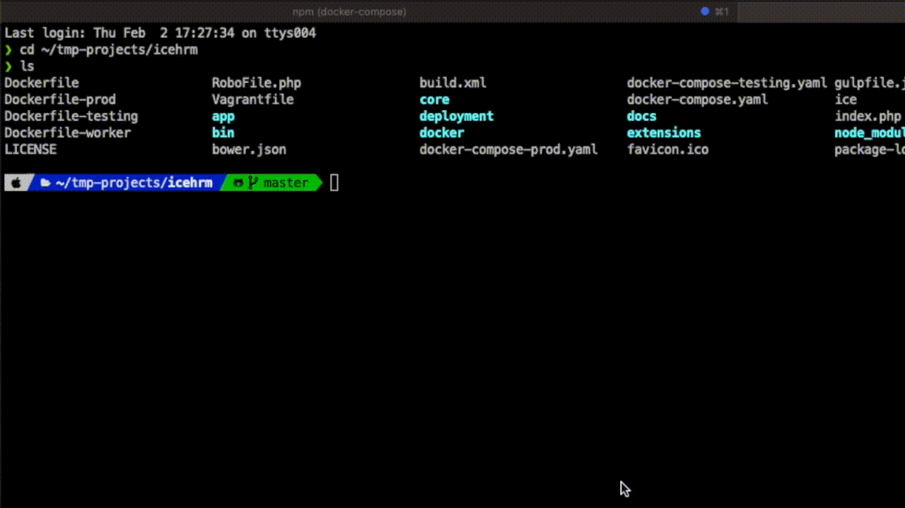

## Setup Development Environment

```bash
git clone https://github.com/gamonoid/icehrm.git
cd icehrm
npm run dev:start:bg
```

`npm run dev:start:bg` is a shortcut for `docker compose -f docker-compose-dev.yaml up -d`.
The `-f` matters: without it Compose picks up `docker-compose.yaml`, which is the
**production** stack — a different port, no bind mount, and no xdebug.

- Visit [http://localhost:5666/](http://localhost:5666/) and login using `admin` as username and password.
- The repository is bind-mounted into the container, so PHP edits are live — no rebuild.
  Changes under `web/` need an asset build (see below).
- Watch this for more detailed instructions: [https://www.youtube.com/watch?v=sz8OV_ON6S8](https://www.youtube.com/watch?v=sz8OV_ON6S8)

### What the dev stack gives you

| Service | URL / port | Notes |
|---------|-----------|-------|
| Web application | [http://localhost:5666](http://localhost:5666) | container `icehrm-dev-app`, built from `Dockerfile-dev` (php-fpm + nginx + xdebug) |
| MySQL | `127.0.0.1:9666` | user `dev`, password `dev`, database `icehrm`; seeded from `docker/init.sql` |
| phpMyAdmin | [http://127.0.0.1:9667](http://127.0.0.1:9667) | signed in as `dev` already |
| MailHog | [http://localhost:9668](http://localhost:9668) | catches all outgoing mail; SMTP on `1166` |

MySQL and phpMyAdmin are published on the loopback interface only — the dev database
ships with known credentials, so it must not be listening on every interface.

Other commands:

```bash
npm run dev:logs     # follow logs
npm run dev:stop     # stop the stack
npm run dev:build    # rebuild the images after changing Dockerfile-dev
```

### Extend IceHrm with custom Extensions

- Inorder to create an admin extension run
```bash
php ice create:extension sample admin
```

The type argument defaults to `admin`, so `php ice create:extension sample` does the
same thing; pass `user` for an employee-facing module.



- Refresh IceHrm to see a new menu item called `Sample Admin`
- The extension code can be found under `icehrm/extensions/sample/admin`
- Refer: [https://icehrm.com/explore/docs/extensions/](https://icehrm.com/explore/docs/extensions/) for more details.

### Building frontend assets

- When ever you have done a change to JavaScript or CSS files in `icehrm/web` you need to rebuild the frontend
- First make sure you have all the dependencies (just doing this once is enough)
```bash
npm run setup
```

- Build assets during development
```bash
npm run asset:build
```

- Build assets for production
```bash
npm run asset:build:prod
```

- Build extensions
```bash
npx gulp ejs --xextension_name/admin
```

`npm run asset:build` runs `gulp` and `asset:build:prod` runs `gulp --eprod`, so use
those rather than calling `gulp` directly unless you have it installed globally. To
start from scratch, `npx gulp clean` empties `web/dist` first.
