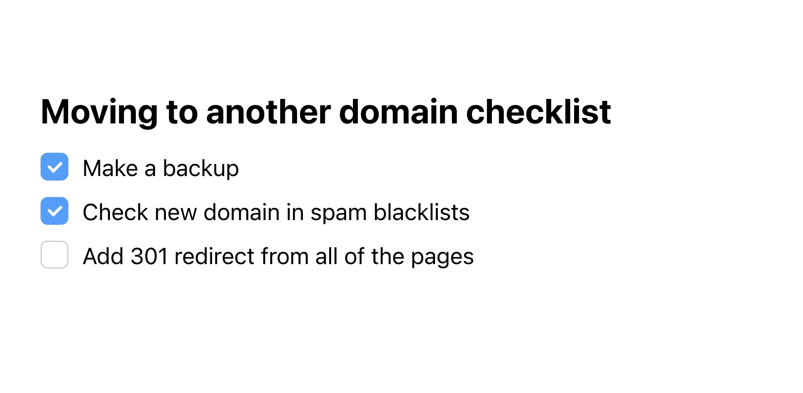

# Checklist Tool for Editor.js

This Tool for the [Editor.js](https://editorjs.io) allows you to add  checklists to your texts.



## Installation

Get the package

```shell
yarn add @editorjs/checklist
```

Include module at your application

```javascript
import Checklist from '@editorjs/checklist'
```

Optionally, you can load this tool from CDN [JsDelivr CDN](https://cdn.jsdelivr.net/npm/@editorjs/checklist@latest)

## Usage

Add a new Tool to the `tools` property of the Editor.js initial config.

```javascript
var editor = EditorJS({
  ...

  tools: {
    ...
    checklist: {
      class: Checklist,
      inlineToolbar: true,
    },
  }

  ...
});
```

## Config Params

This Tool has no config params


## Output data

| Field | Type       | Description                            |
| ----- | ---------- | -------------------------------------- |
| items | `object[]` | array of checklist's items             |


```json
{
    "type" : "checklist",
    "data" : {
        "items" : [
            {
              "text" : "This is a block-styled editor",
              "checked" : true
            },
            {
              "text" : "Clean output data",
              "checked" : false
            },
            {
              "text" : "Simple and powerful API",
              "checked" : true
            }
        ]
    }
}
```

