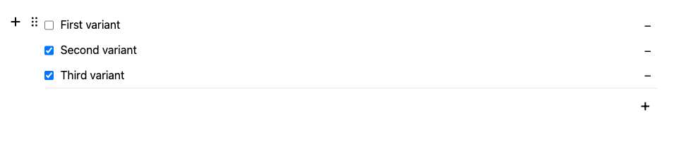

# Quiz Tool for Editor.js

This tool for the [Editor.js](https://editorjs.io) allows you to add single select and multi select tests, submitting them.



## Installation

```shell
npm i @juratbek/editorjs-quiz
```

```shell
yarn add @juratbek/editorjs-quiz
```

## Usage

Add the Quiz tool to the `tools` property of the Editor.js initial config.

```javascript
import EditorJs from "@editorjs/editorjs";
import Quiz from "@juratbek/editorjs-quiz";

const editor = EditorJs({
  // ...
  tools: {
    quiz: {
      class: Quiz,
      config: {
        onSubmit: submitCallback,
      },
    },
  },
});
```

## Config Params

| Field    | Type       | Description                                                                             |
| -------- | ---------- | --------------------------------------------------------------------------------------- |
| onSubmit | `Function` | Function callback which will be called on submit. It is available in `readOnly` mode    |
| language | `string`   | language of the tool. Currently Uzbek (`uz`) and English (`en`) languages are supported |

## Output data

| Field    | Type       | Description                                                                                                                       |
| -------- | ---------- | --------------------------------------------------------------------------------------------------------------------------------- |
| variants | `object[]` | list of variants which is added in the tool. A variant will contain `value` and `text` fields (`{ value: number, text: string }`) |
| answers  | `number[]` | list of values of right answers, which is selected by the editor. This values is got from `value` field of the variants           |
| type     | `string`   | type of the quiz (`singleSelect` or `multiSelect`)                                                                                |
