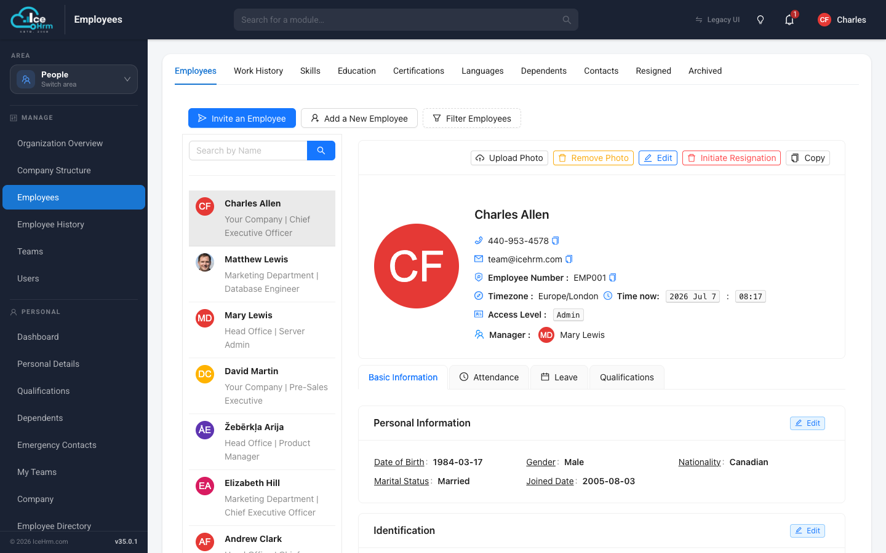
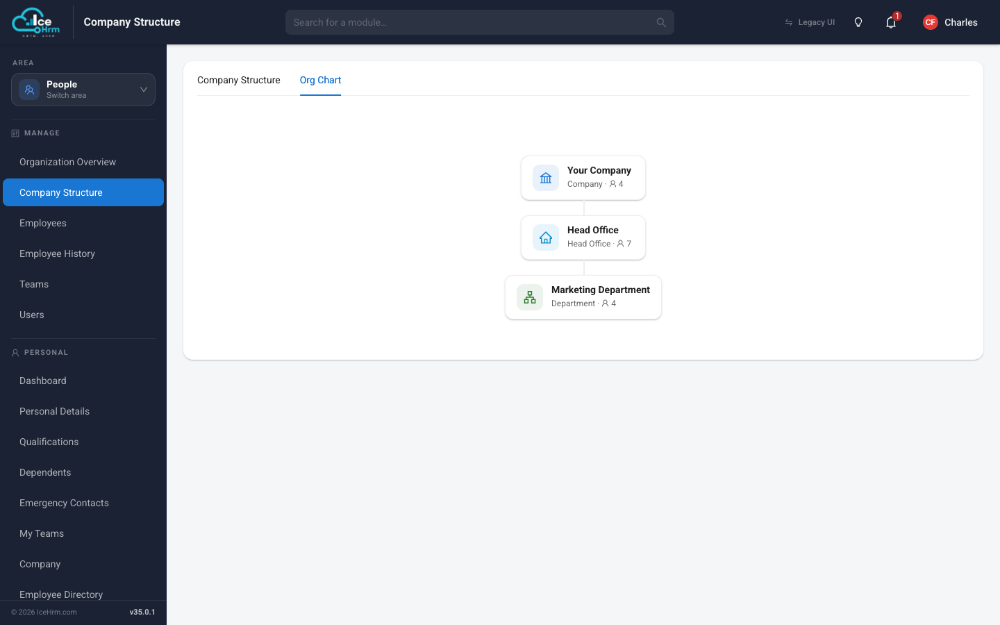
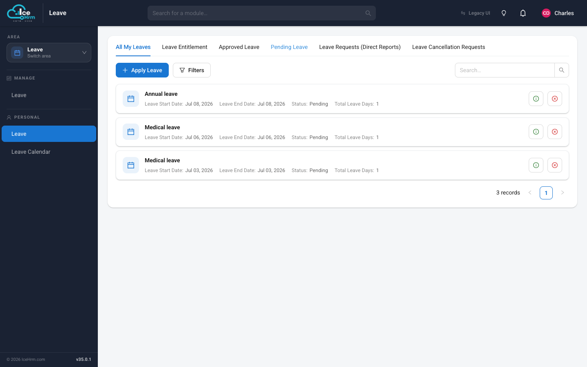
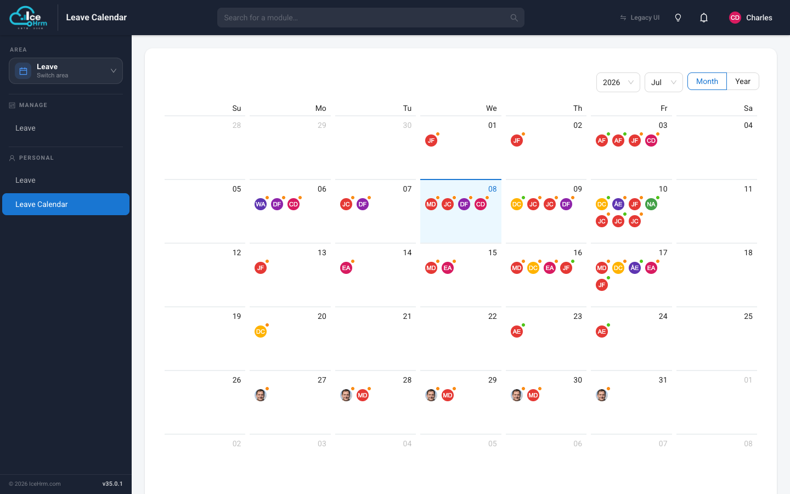
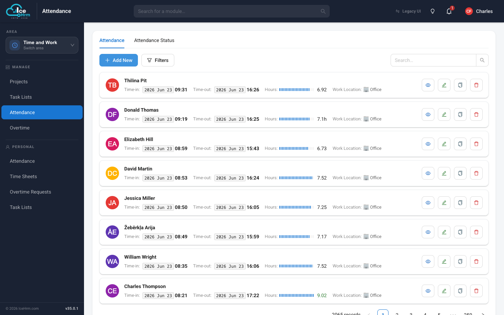
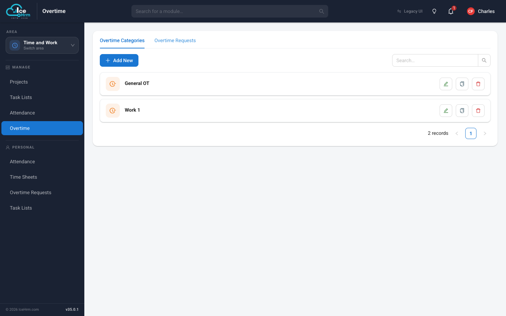
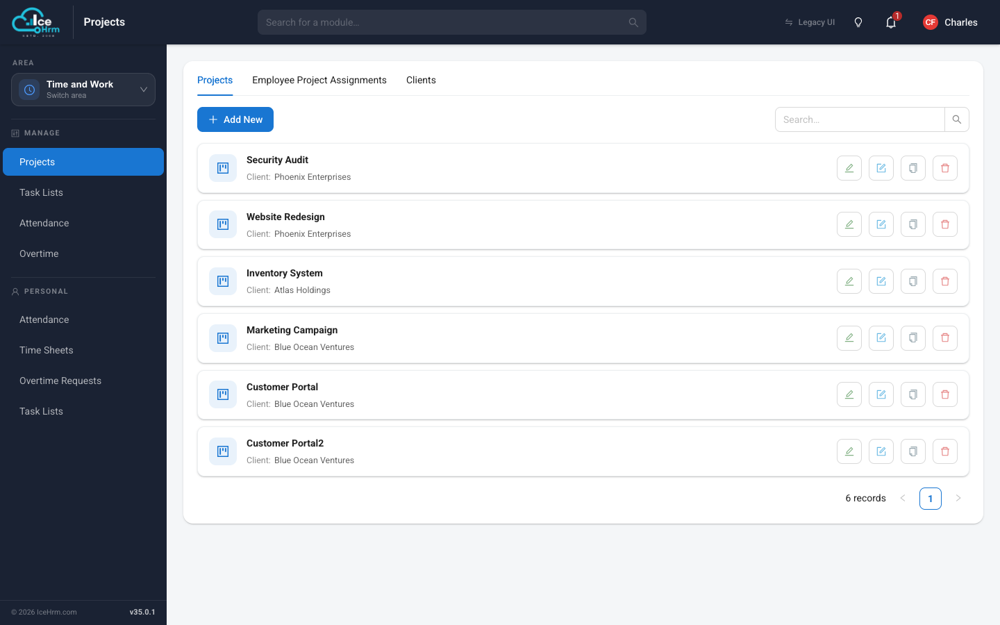
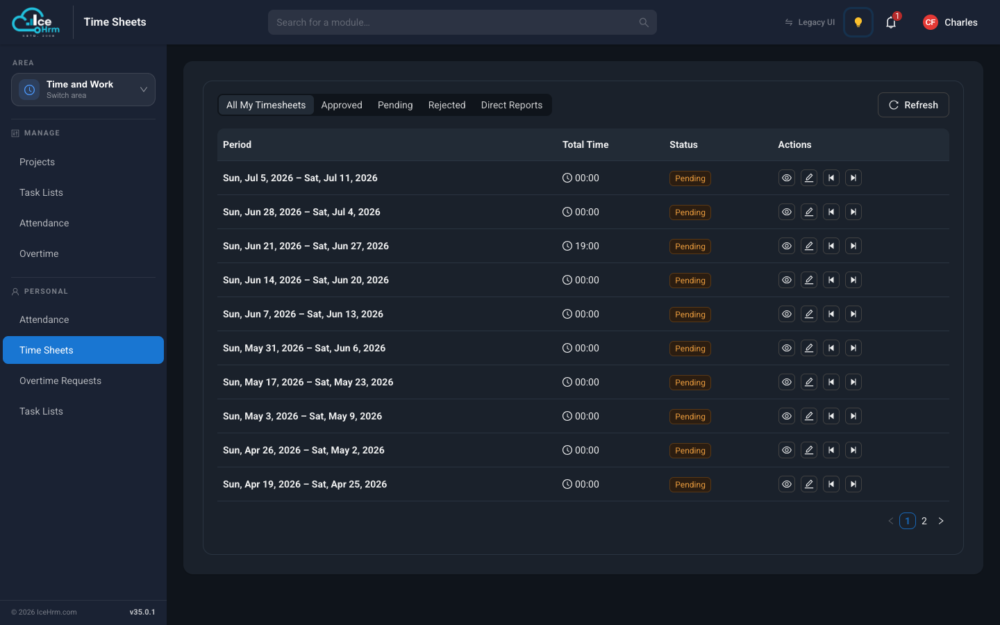
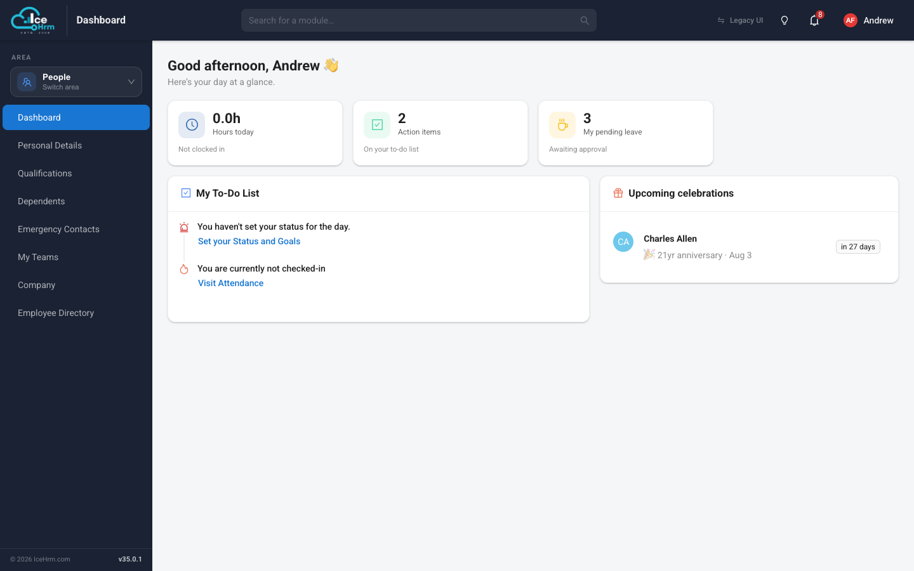
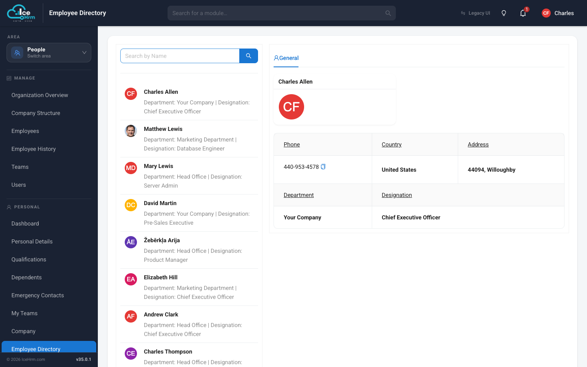

IceHrm
===========

IceHrm is a comprehensive [HRM software](https://icehrm.com) that enables companies to manage employee information, track attendance, handle leave requests, and streamline HR workflows.

### Core HR Management

| Employee Management | Company Structure |
|:-------------------:|:-----------------:|
|  |  |

Centralized employee records — personal details, job history, qualifications, documents
and dependents — with a company structure you can browse as a list or an org chart.

### Leave Management

| Apply and Track Leave | Team Leave Calendar |
|:---------------------:|:-------------------:|
|  |  |

Employees apply for leave and see their entitlement, pending and approved requests in one
place; managers approve or reject from the same screen. Administrators define leave types,
the leave period, the work week and public holidays, and can post manual leave adjustments.
The calendar lays the whole team's absences across the month so clashes are obvious before
anything is approved.

### Time & Attendance

| Attendance | Overtime |
|:----------:|:--------:|
|  |  |

Punch in and out with a full attendance history per employee, and an overtime request and
approval flow on top of it.

### Projects & Timesheets

| Clients and Projects | Timesheets |
|:--------------------:|:----------:|
|  |  |

Track clients and projects, assign employees to them, and capture weekly timesheets with a
per-project breakdown and an approval step.

### Employee Self-Service

| Employee Dashboard | Staff Directory |
|:------------------:|:---------------:|
|  |  |

Every employee gets their own dashboard — leave balances, upcoming holidays, pending
requests — plus a searchable directory of colleagues.

## Getting Started

> **💡 Prefer not to self-host?** IceHrm is available as a fully managed service at [icehrm.com](https://icehrm.com) — no installation or maintenance required.

<table>
<tr>
<td align="center" colspan="2">

### How do you want to use IceHrm?

</td>
</tr>
<tr>
<td align="center" width="50%">

### 🚀 PRODUCTION
**Deploy for your organization**

⬇️

</td>
<td align="center" width="50%">

### 🛠️ DEVELOPMENT
**Contribute or extend IceHrm**

⬇️

[Setup Development Environment](docs/setup-development-environment.md)

</td>
</tr>
</table>

---

## Production Deployment

> **Choose your deployment method:**

<table>
<tr>
<td align="center" width="50%">

### 🐳 Option A: Docker

**Fastest way to get started**

Ideal for quick deployments and containerized environments.

➡️ [**Docker Quick Start Guide**](docs/docker-quickstart.md)

</td>
<td align="center" width="50%">

### 🖥️ Option B: Linux VPS

**Traditional server deployment**

Full control over your environment and custom configurations.

➡️ [**Linux Installation Guide**](https://icehrm.com/docs/installation/install-linux)

</td>
</tr>
</table>

### Docker in one command

```bash
git clone https://github.com/gamonoid/icehrm.git
cd icehrm
docker compose up -d --build
```

The build compiles the frontend assets inside the image, so the first run takes a
few minutes. When it finishes, IceHrm is at
[http://localhost:5555](http://localhost:5555) — sign in with `admin` / `admin` and
change that password before exposing the installation.

The stack is three containers: the application, a MySQL 8 database seeded from
`docker/init.sql`, and a worker for background jobs. Settings and uploads live in
named volumes (`icehrm-app-data`, `icehrm-mysql-data`) and survive a rebuild. To
change the port, base URL or database credentials, copy `docker-prod.env.example`
to `.env` first — see the [Docker Quick Start Guide](docs/docker-quickstart.md).


### Keeping an installation current

From v36, IceHrm updates itself. Administrators see a banner on the dashboard when
a newer release is published; the updater downloads it, backs the current version
aside before replacing anything, preserves `app/config.php`, `app/data/` and any
extensions you installed yourself, and can roll back from the same screen if the
application does not come back.

---

## After Installation

<table>
<tr>
<td align="center">

### ✅ IceHrm is Running!

⬇️

</td>
</tr>
</table>

<table>
<tr>
<td align="center">

### Step 1: Connect to IceHrm.com

Link your installation to unlock extensions and receive updates.

➡️ [**Connection Guide**](https://icehrm.com/docs/extension-management/connecting-to-icehrm)

⬇️

</td>
</tr>
<tr>
<td align="center">

### Step 2: Install Extensions

Expand IceHrm with powerful modules for your business needs.

➡️ [**Extension Installation Guide**](https://icehrm.com/docs/extension-management/purchasing-extensions)

⬇️

</td>
</tr>
</table>

---

## Resources

- [Official Documentation](https://icehrm.com/docs)
- [Extension Marketplace](https://icehrm.com/explore)
- [Community Support](https://github.com/gamonoid/icehrm/issues)
