# IceHrm - v36

**Release Date:** August 2026
**Version:** 36.0.0

IceHrm v36 is the largest interface release in the product's history. The entire
application has been rebuilt as a single-page React experience — a persistent shell with
instant navigation, a global module search, in-app notifications, a full dark theme, and
a layout that works on a phone. Alongside it come redesigned dashboards, a visual org
chart, an extensions marketplace, clearer payroll formula validation, and a built-in
updater that keeps your installation current without touching a terminal.

---

## Table of Contents

1. [A Completely New Interface](#a-completely-new-interface)
2. [Redesigned Dashboards](#redesigned-dashboards)
3. [Visual Company Structure](#visual-company-structure)
4. [Modernised Everyday Screens](#modernised-everyday-screens)
5. [Extensions Marketplace](#extensions-marketplace)
6. [Smarter Payroll Formulas](#smarter-payroll-formulas)
7. [Built-in Updater](#built-in-updater)
8. [UI/UX Improvements](#uiux-improvements)
9. [Upgrade Notes](#upgrade-notes)

---

## A Completely New Interface

IceHrm now runs as a single-page application. The shell — navigation, search, header and
notifications — stays loaded while you work, so moving between modules is instant instead
of a full page reload.

### Instant Navigation

- **Persistent application shell** - The sidebar and header never reload; only the
  content area changes
- **Areas** - Modules are grouped into areas (People, Time and Work, Leave, Pay),
  switchable from the top of the sidebar, so long menus stay manageable
- **Global module search** - Type in the header search box to jump straight to any module
  you have access to, with no hunting through menus
- **Permission-aware menu** - The sidebar shows only what the signed-in user may open
- **Deep links** - Every module has its own address, so screens can be bookmarked and
  shared

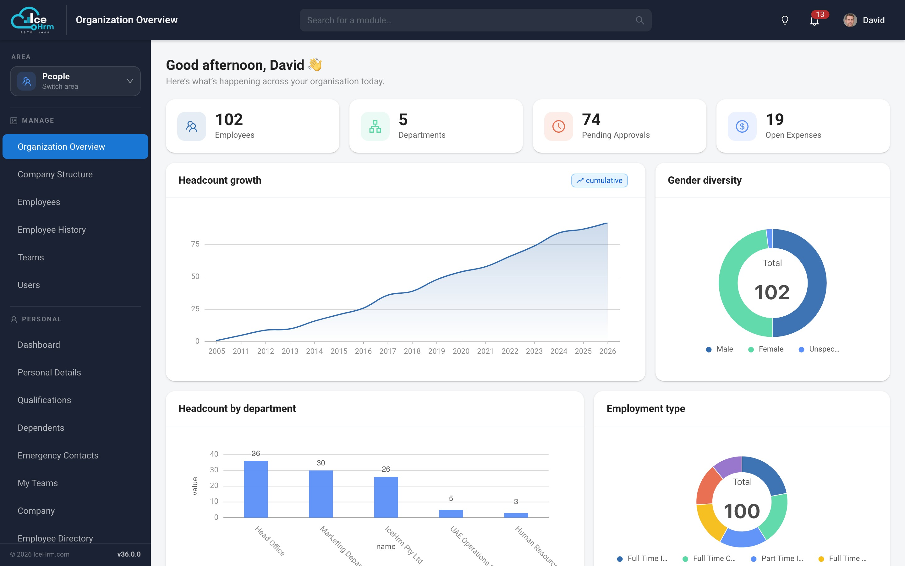

### Dark Mode

A full dark theme across the entire application, remembered per browser and applied
before the first paint so there is no white flash on load. Charts, dialogs, tables and
forms are all themed — including the older screens that have not yet been rebuilt.

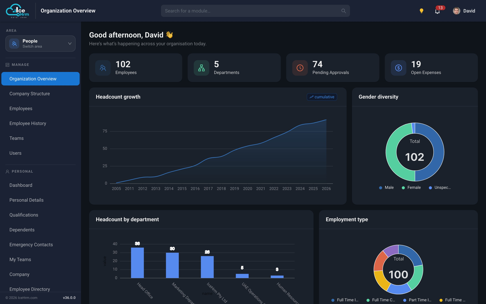

### Works on a Phone

The layout adapts to small screens: the sidebar collapses into a drawer, cards stack, and
tables become scrollable, so employees can check leave balances, submit requests and view
payslips from a phone browser.

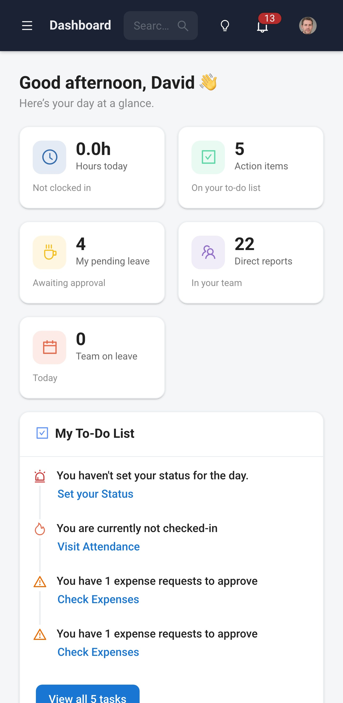

### In-App Notifications

Approvals, assignments and reminders now appear in a notification tray in the header,
with an unread count, rather than relying solely on email.

---

## Redesigned Dashboards

Both the administrator and employee dashboards have been rebuilt natively.

### Organization Overview

A live picture of the organisation for administrators and HR managers:

- **Headline figures** - Employees, departments and pending approvals, as cards that are
  clickable and take you straight to the relevant module
- **Headcount growth** - Cumulative headcount over time
- **Gender diversity and employment type** - Composition of the workforce at a glance
- **Headcount by department** - Where people actually sit in the organisation
- **Personalised greeting** - The dashboard greets the signed-in user by name

### Employee Dashboard

A personal home page showing leave balances, upcoming holidays, pending requests,
assigned tasks and training — the things an employee actually needs on arrival.

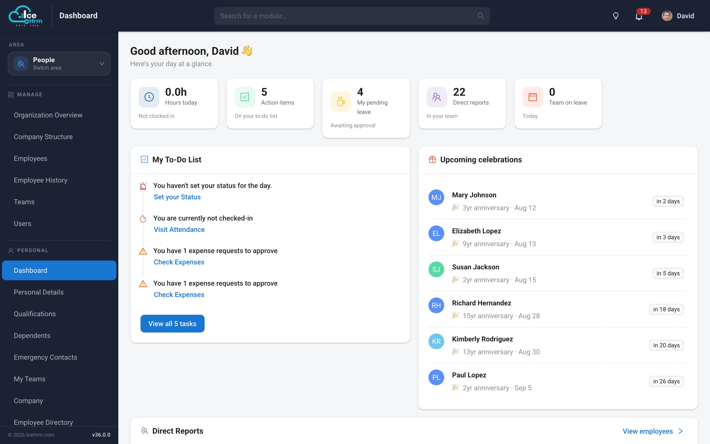

---

## Visual Company Structure

The company structure module now has two views. The list gives you each unit with its
type, reporting line, address, country, timezone and headcount, with inline edit,
duplicate and delete. The new **Org Chart** tab renders the same data as a proper
hierarchy.

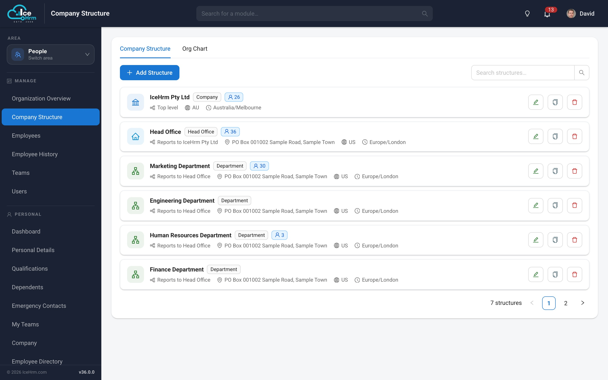

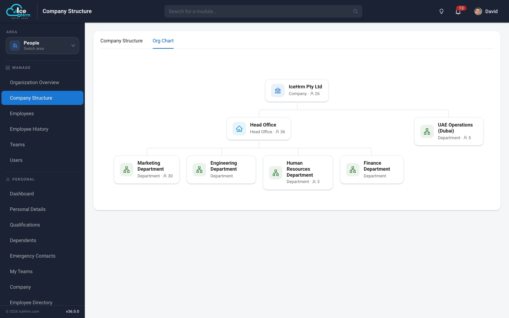

The employee-facing **Company** view presents the same structure to staff, so everyone can
see how the organisation fits together.

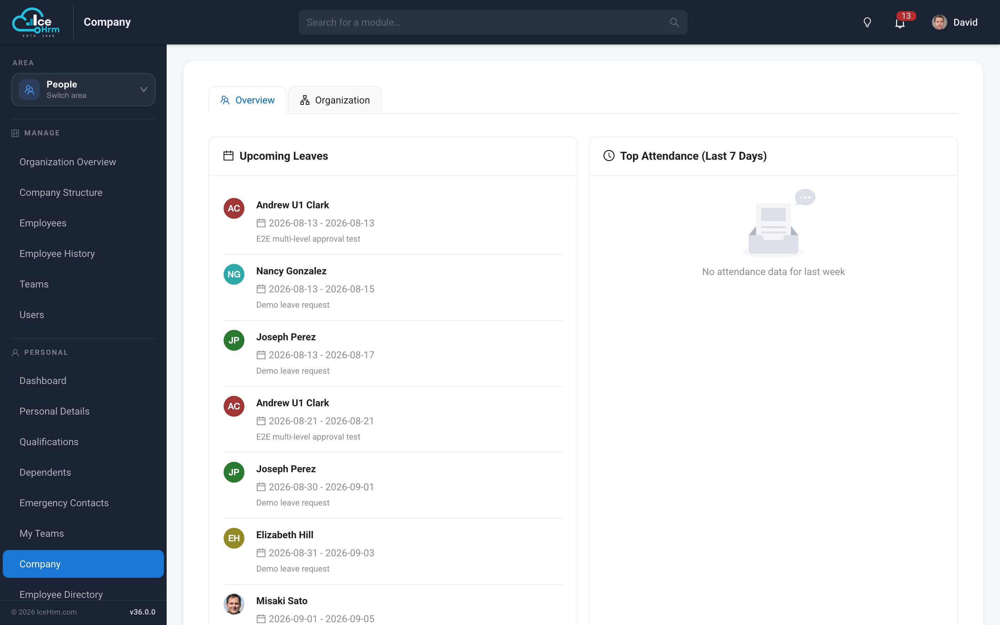

---

## Modernised Everyday Screens

The screens people use daily have been rebuilt as native React views — no more embedded
frames, consistent styling, and dialogs that match the rest of the application.

### Employee Directory

Searchable directory of colleagues with photos, roles and contact details.

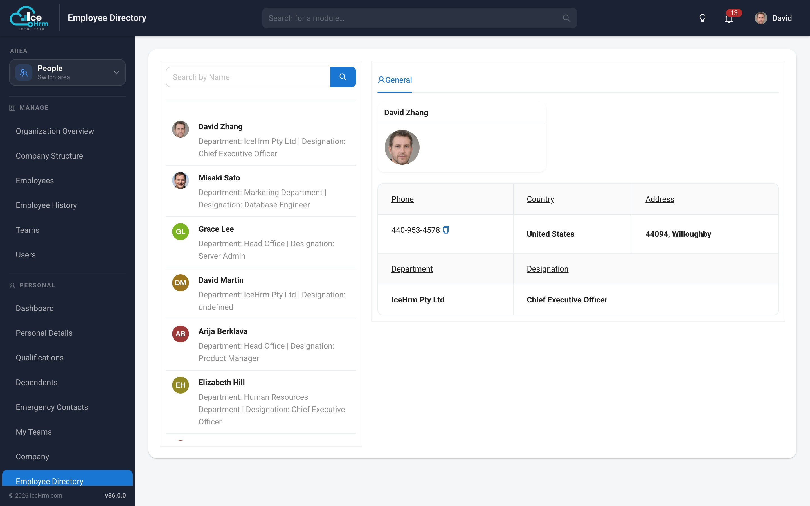

### Leave Calendar

See team leave laid out across the month, so overlapping absences are obvious before they
are approved.

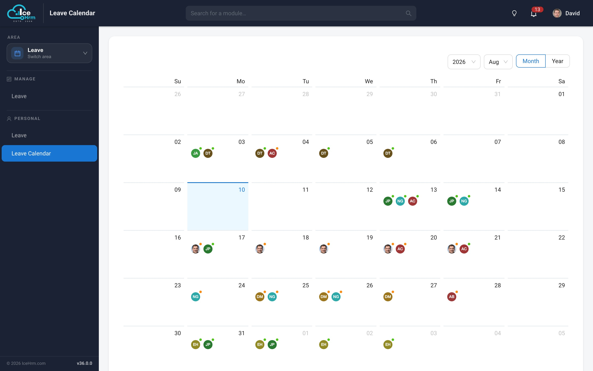

### Time Sheets

Weekly timesheet entry and review with project breakdowns and an approval flow.

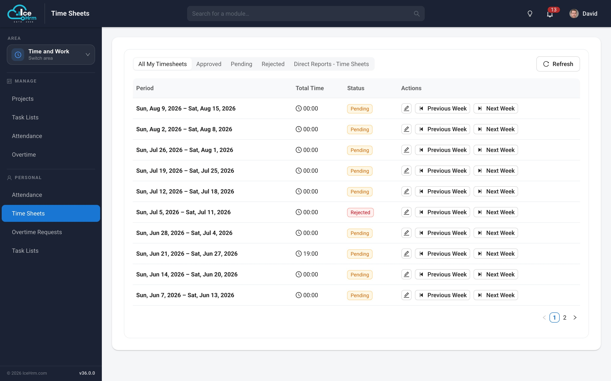

### Employee Profile

Personal details, qualifications, dependents, emergency contacts and documents organised
into tabs, with profile photos shown consistently across the application.

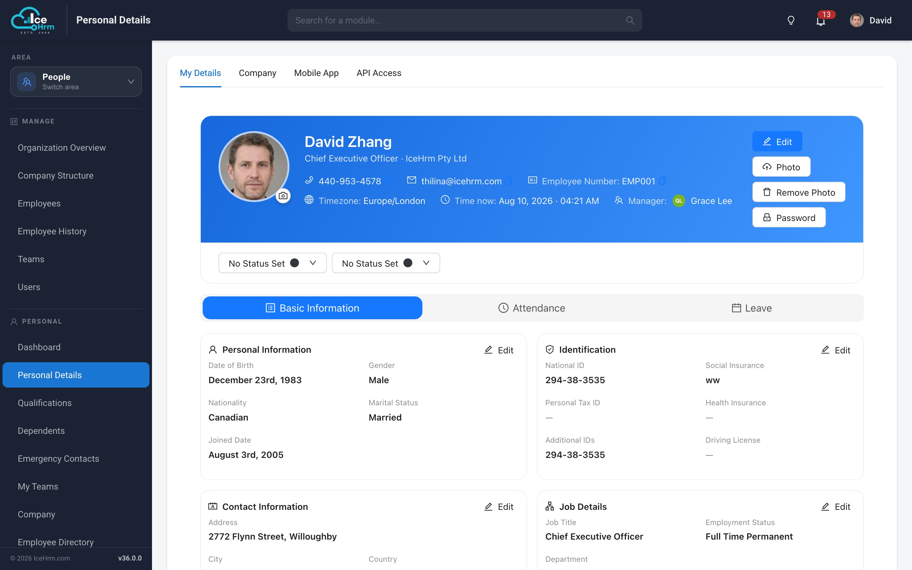

---

## Extensions Marketplace

Browse and manage the extensions available to your installation from inside the
application, with licence status for each one.

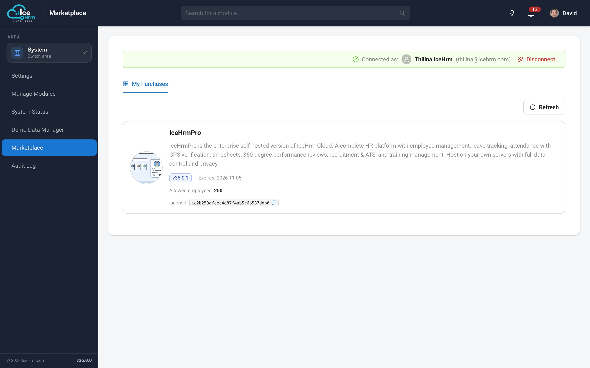

---

## Smarter Payroll Formulas

Payroll columns can be calculated with JavaScript functions, and the editor now tells you
exactly what is wrong with one instead of simply refusing it.

- **Precise syntax errors** - The problem and the line number, for example
  *Unexpected end of input: unclosed '{' (line 3)*
- **Unknown variables are caught** - A misspelt variable name is valid JavaScript that
  quietly evaluates to zero, so a column would silently compute the wrong figure. The
  validator now names it and suggests the correction:
  *Unknown variable not available to this function: "gpssRate" (did you mean
  "gpssaRate"?)*
- **Clear result checks** - Functions that return nothing, produce NaN, or divide by zero
  are reported in plain language
- **Consistent arithmetic** - Rounding, division and number formatting behave identically
  everywhere, so a formula produces the same figure on every installation

Supported in formulas: functions, arithmetic, `Math` functions, arrays, strings,
conditionals and loops.

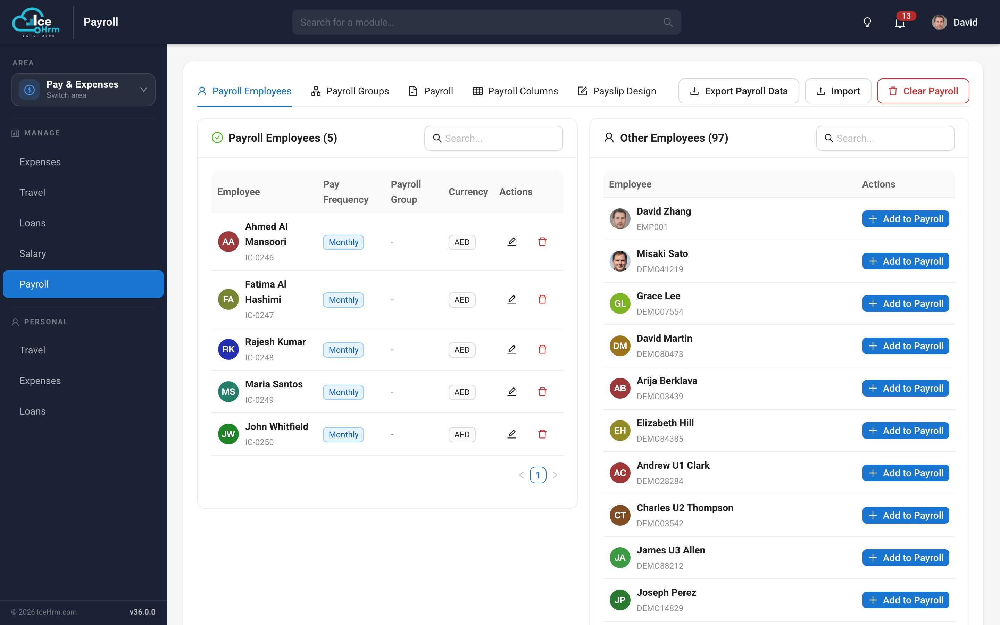

---

## Built-in Updater

IceHrm can now update itself. When a newer version is published, administrators see a
banner on the dashboard.

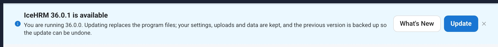

- **What's New** opens the changelog for your edition
- **Update** opens the updater, which downloads the release, checks the version, and asks
  you to confirm before anything is replaced

The update itself is designed to be reversible:

- **Your data is kept** - Configuration, uploads and cached files are never replaced
- **Extensions you installed yourself are preserved** - Anything not part of the release
  is left untouched and reported to you
- **Automatic backup** - The previous version is moved aside before the new files are
  copied in, and is only removed once the update is confirmed working
- **One-click rollback** - If the application does not come back, the previous version can
  be restored from the same screen
- **Full log** - Every step is written to a log file for support

---

## UI/UX Improvements

- Material-style theme with Roboto typography throughout, replacing the previous default
  serif font
- Consistent card layouts, spacing and iconography across every module
- Themed dialogs and forms, including on the older screens
- Charts restyled and made readable in both light and dark themes
- Clickable KPI cards that navigate to the underlying module
- Bundled public-holiday import for the Holidays tab
- Module descriptions throughout the Manage Modules screen
- Employee profile photos shown consistently in lists, charts and headers
- Improved layout on smaller screens across all rebuilt modules

---

## Upgrade Notes

### Database Migrations

Database changes are now applied automatically the next time any user signs in — there is
no separate step and no need to visit a particular screen first. If several people sign in
at once after an upgrade, the migration runs exactly once.

### Extensions

Extensions are now organised into free and paid sets. Existing installations continue to
work unchanged; extensions you installed yourself are preserved across updates.

### Requirements

No change. IceHrm v36 runs on the same PHP and MySQL versions as v35.

### Breaking Changes

None. All changes are backward compatible.

---

## Coming Soon

- Further modules rebuilt as native React views
- Continued mobile experience improvements
- Workflow automation
